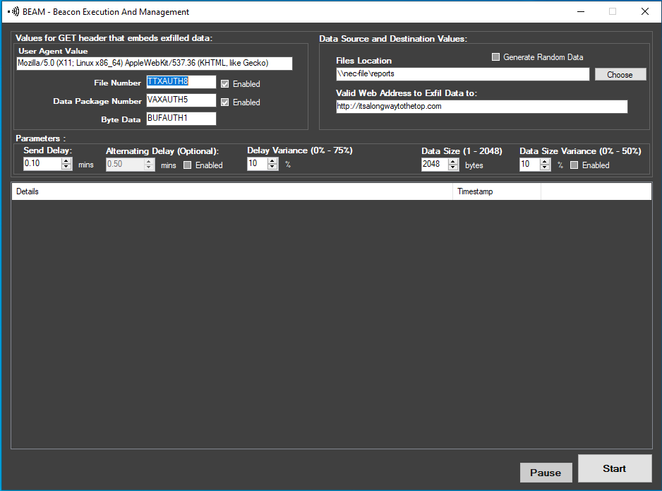

# BEAM - Beacon Execution and Managment

BEAM is a tool to generate realistic network beacon traffic for use in cyber ranges. Software that exhibits beaconing activity on a network can indicate the presence of an adversary on a network. BEAM generates traffic on a specific timeline—every n minutes—that exercising teams can use to train against detecting and identifying beaconing activity over different timespans. [View on Github](https://github.com/cmu-sei/ghosts-cyber-range-and-exercise-simulation-tools)

## Installation

### Windows

### Linux

## File Desciption

    Beam.exe    # The compiled executable
    Beam.exe.config # The configuration file.

## User Guide

    mkdocs.yml    # The configuration file.
    docs/
        index.md  # The documentation homepage.
        ...       # Other markdown pages, images and other files.
